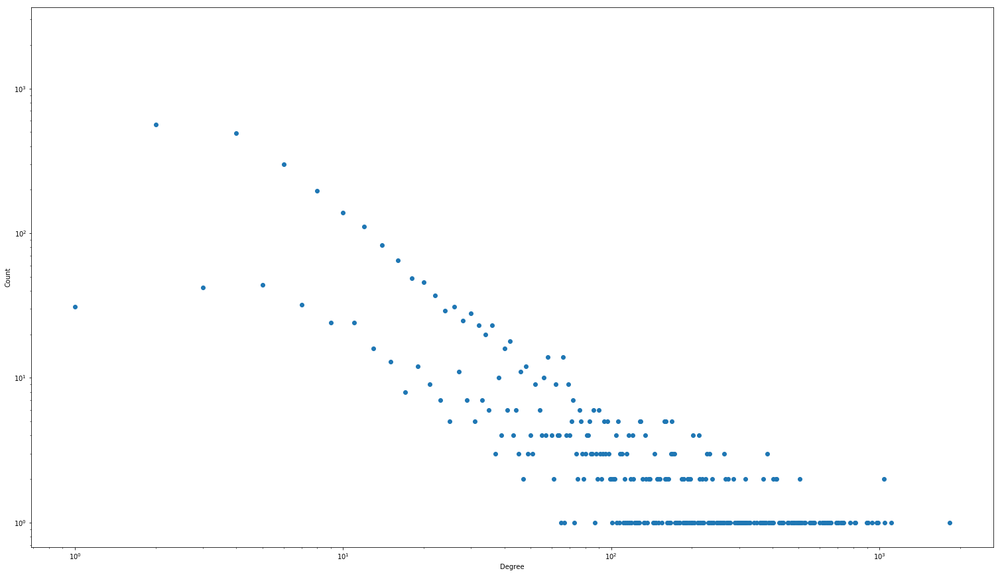

# Network

First we looked at the degree distribution of the network, which is visualized in the two following plots.

The loglog plot over the distribution makes it easier to see more significate differences between the frequency of the different degrees.
Here it it is clear that a large part of the airports have very few routes.
For the airports with more routes, many of them have a unique number of routes, which makes sense when the number of airports in the world are still limited.
Another interesting feature of the plot, is that it looks like it is following two different powerlaws.
However, looking at each of them individually, it becomes clear that the upper one are for all of the airports with an even number of routes, while the lower is for every airport with an odd number.
This shows that if an airport has a route going from A to B, it most likely also has a route going from B to A.
Still, it is interesting that around 200 airports only have one route!

